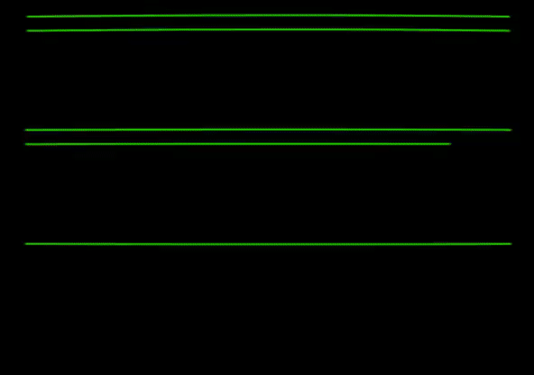

|   |   |
|---|---|
| | |
| | |
| | |

These are programs I wrote for an Apple II computer, which looks like this:

If you're interested in learning 6502 assembly language, I *highly* recommend [Easy 6502](https://skilldrick.github.io/easy6502/). It's a fun, thoughtful, and joyful tutorial.

For Apple II-specific details, try the [Technical Reference Manual](https://archive.org/details/Apple_IIe_Technical_Reference_Manual/page/n34/mode/1up?view=theater) -- it's suprisingly readable! There's also tons of great hobbyist content on the internet. There are definitely some quirks -- displaying stuff on the screen isn't as simple as it could be. But for the most part, it's a really small and elegant machine.
